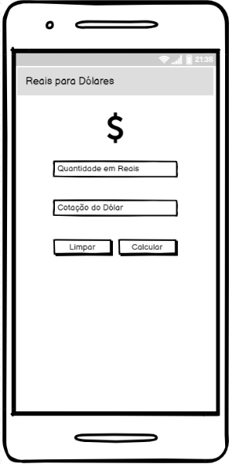
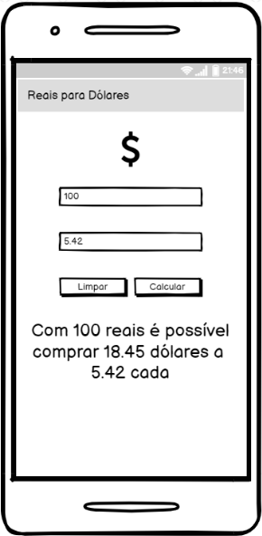

# Enunciado

deverá criar um aplicativo em Flutter para realizar a conversão de reais em dólares.

O aplicativo deverá ter dois campos, um para informar a quantidade de reais e outro a
cotação do dólar.

Abaixo dos campos deverá ter um botão que, ao ser clicado, realizará a conversão, mostrando em tela quantos dólares é possível comprar com a quantidade de reais informada considerando a cotação informada. Opcionalmente pode ser incluído um botão para realizar a limpeza dos campos e do resultado.

Os wireframes abaixo ilustram como seria o aplicativo, não é necessário fazer exatamente
dessa forma, o aluno pode customizar conforme desejado.

