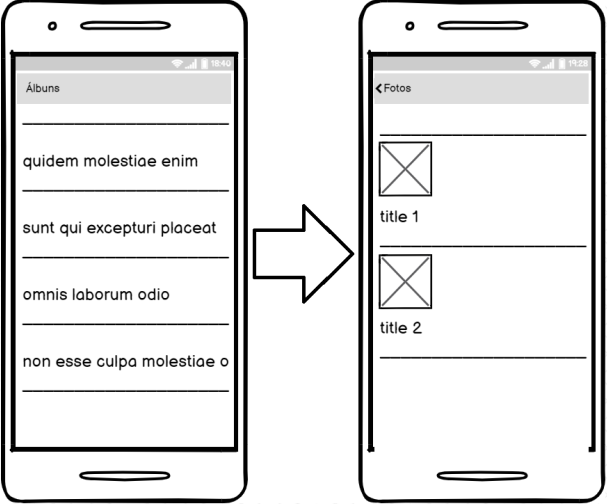

# Enunciado

Desenvolver um aplicativo em Flutter que deverá consumir alguns serviços da API pública
disponibilizada pelo site JSONPlaceholder [jsonplaceholder.typicode.com](https://jsonplaceholder.typicode.com/).

# Atividades

O desafio consiste em desenvolver um aplicativo em Flutter, que deverá consumir os endpoints de __albums__ e __photos__ do site JSONPlaceholder [jsonplaceholder.typicode.com](https://jsonplaceholder.typicode.com/). O aplicativo terá duas telas, a primeira deverá listar os álbuns de fotos de determinado usuário. A segunda tela deve ser aberta ao clicar em um álbum, listando as fotos referentes ao álbum clicado. Veja a imagem abaixo:




Para montar a lista de álbuns, é preciso realizar um GET no endpoint abaixo: https://jsonplaceholder.typicode.com/users/1/albums O número 1 no endpoint acima indica o id do usuário. O aluno pode deixar esse número fixo no código, porém no questionário do desafio pode ser solicitado que seja trocado esse número para verificação. O retorno desse endpoint será uma lista de álbuns, a imagem abaixo ilustra uma parte este retorno. Na listagem dos álbuns deve ser mostrado na tela a propriedade __title__.

```json
[
  {
    "userId": 1,
    "id": 1,
    "title": "quidem molestiae enim"
  },
  {
    "userId": 1,
    "id": 2,
    "title": "sunt qui excepturi placeat culpa"
  },
  {
    "userId": 1,
    "id": 3,
    "title": "omnis laborum odio"
  },
]
```

Quando o usuário clicar em um desses álbuns, deverá ser consumido o método que retorna as fotos desse álbum, utilizando para isso o endpoint: [https://jsonplaceholder.typicode.com/albums/1/photos](https://jsonplaceholder.typicode.com/albums/1/photos). O número 1 no endpoint acima indica o número do álbum selecionado pelo usuário. Este endpoint irá retornar uma lista de fotos, a imagem abaixo ilustra uma parte deste retorno.

```json
[
  {
    "albumId": 1,
    "id": 1,
    "title": "accusamus beatae ad facilis cum similique qui sunt",
    "url": "https://via.placeholder.com/600/92c952",
    "thumbnailUrl": "https://via.placeholder.com/150/92c952"
  },
  {
    "albumId": 1,
    "id": 2,
    "title": "reprehenderit est deserunt velit ipsam",
    "url": "https://via.placeholder.com/600/771796",
    "thumbnailUrl": "https://via.placeholder.com/150/771796"
  },
  {
    "albumId": 1,
    "id": 3,
    "title": "officia porro iure quia iusto qui ipsa ut modi",
    "url": "https://via.placeholder.com/600/24f355",
    "thumbnailUrl": "https://via.placeholder.com/150/24f355"
  },
]
```

Esta tela deverá mostrar uma lista com o __title__ da foto e o seu __thumbnailUrl__ em uma imagem. O “thumbnailUrl” consiste na URL de uma imagem, que deve ser mostrada nessa tela juntamente com o __title__.