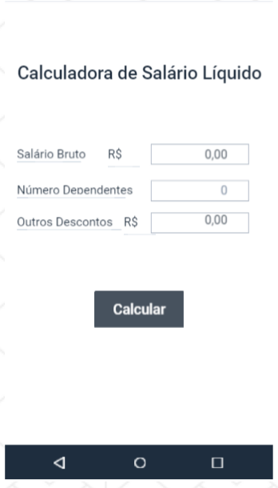

# Enunciado

Crie um aplicativo Android que irá realizar o cálculo do salário líquido de um trabalhador CLT, considerando as regras a serem apresentadas
abaixo. O aplicativo será composto por duas telas, conforme os wireframes a seguir:  

  

A primeira tela do aplicativo é composta pelos campos numéricos: Salário Bruto, Número de dependentes e Outros Descontos, e um botão para realizar o cálculo. Ao acionar obotão, o sistema deverá realizar os cálculos e apresentar na segunda tela do aplicativo os valores consolidados (Salário Bruto, Valor de Desconto do INSS, Valor de Desconto do IRRF, Outros Descontos), apresentar o salário liquido, considerando os descontos apresentados, e o percentual total de descontos sob o salário Bruto. Na segunda tela haverá um botão para retornar à tela principal.  

## Explicação do cálculo  

### INSS  

O salário de um trabalhador CLT tem o desconto do INSS, conforme tabela a seguir:  

| Salário de Contribuição            | Alíquota  | Dedução  |
|------------------------------------|-----------|----------|
| Até um salário minimo (R$ 1.045,00)|  7,5%     |    -     |
| De R$ 1.045,01 até 2.089,60        |   9%      |R$ 15,67  |
| De R$ 2.089,61 até 3.134,40        |  12%      |R$ 78,36  |
| De R$ 3.134,41 até 6.101,06        |  14%      |R$ 141,05 |

Veja como fica o exemplo de cálculo do desconto do INSS para um salário bruto de R$ 3.000,00. Este valor está na terceira faixa, assim é aplicada a alíquota de 12% (R$ 360,00) e descontado a dedução de R$ 78,36 (R$ 360,00 – R$ 78,36), o que teria um desconto de R$ 281,64 de INSS. Importante ressaltar que a contribuição máxima é de R$ 713,10, para salários maiores que R$6.101,06.

### IRRF

O imposto de renda retido na fonte (IRRF) tem como base para cálculo o seguinte valor: Base de cálculo = salário bruto – contribuição para o INSS – número de dependentes x 189,59 A partir desta base de cálculo a seguinte tabela é aplicada:

|Base de cálculo                     | Alíquota  | Dedução  |
|------------------------------------|-----------|----------|
| Até um salário minimo (R$ 1.045,00)|   0%      |    -     |
| De R$ 1.045,01 até 2.089,60        |   7,5%    |R$ 142,80 |
| De R$ 2.089,61 até 3.134,40        |  22,5%    |R$ 354,80 |
| De R$ 3.134,41 até 6.101,06        |  27,5%    |R$ 636,13 |

Veja como fica o exemplo de cálculo do desconto do IRRF para um salário bruto de R$ 3.000,00. Base de cálculo é R$ 2.718,36 (R$ 3.000,00 – INSS de R$ 281,64), assim é aplicada a alíquota de 7,5% (R$ 203,87) e descontada a dedução de R$ 142,80 (R$ 203,87– R$ 142,80), o que teria um desconto de R$ 61,08 de IRRF.

#### Resumo

- Implementar um aplicativo, considerando os protótipos de tela apresentados.
  
- Implementar a lógica de cálculo do salário líquido conforme regra descrita.

- Implementar a lógica para os botões dos protótipos.

