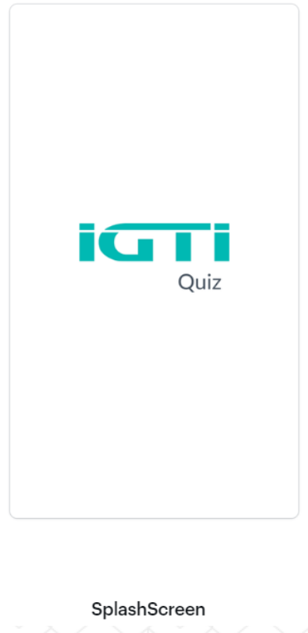
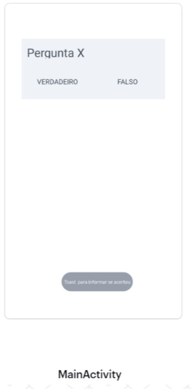
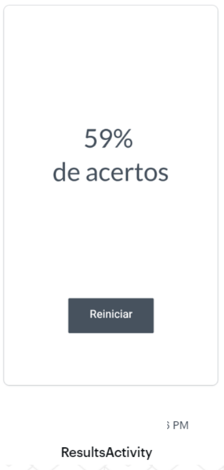

# Enunciado

Desenvolver o aplicativo IGTI Quiz que possuirá os seguintes wireframes:

A SplashScreen será exibida utilizando a imagem anexa [(igti_quiz.png)](app/src/main/res/mipmap-xxxhdpi/igti_quiz.png) ao desafio.

A MainActivity irá exibir um CardView com a pergunta e os botões de resposta (Verdadeiro ou Falso), ao acertar a pergunta, a Activity deverá notificar o usuário se acertou ou se errou com a mensagem “Acertou!” e “Errou!”, respectivamente. A lista de perguntas e respostas está no arquivo Perguntas.txt em anexo.

A ResultsActivity será exibida ao final de todas as perguntas respondidas com o percentual de acertos do usuário e o botão para reiniciar o quiz.

## Desafios

- Implementar um aplicativo, considerando os protótipos de tela apresentados.

- Implementar a lógica de para exibição da SplashScreen somente no primeiro login do usuário com um timer de 1000ms(1 segundo).

- Implementar a lógica para exibir as perguntas no CardView bem como a lógica para acerto ou erro da questão.

- Implementar a lógica para exibir o resultado final na ResultsActivity, bem como a ação do botão de reiniciar o Quiz.

- As perguntas e respostas disponibilizadas no arquivo em anexo ([Perguntas.txt](app/src/main/assets/Perguntas.txt)) deverão ser carregadas na memória do dispositivo ao realizar o primeiro login no aplicativo.

- A estrutura para armazenamento das perguntas e respostas no aplicativo fica ao seu critério. O arquivo foi disponibilizado apenas como base de dados padrão.
